# Credit_Risk_Analysis

## Project Overview
The purpose of this analysis is to use Resampling Models, a SMOTEEN Algorithm and Ensemble Classifiers to predict credit risk for loans.

## Resources
- Data Source: cLoanStats_2019Q1.csv
- Software: Pyton 3.7, scikit-learn 1.0.1, scipy 1.7.1, numpy 1.20.3

## Results
###Naive Random Oversampling
- Balanced Accuracy Score: 0.6497536370265621
- Confusion Matrix:
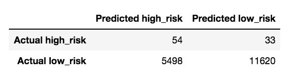
- Imbalanced Classification Report
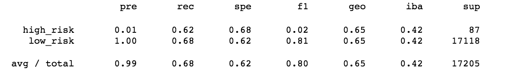

###SMOTE Oversampling
- Balanced Accuracy Score: 0.6443721269403855
- Confusion Matrix:
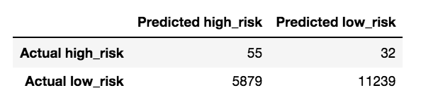
- Imbalanced Classification Report
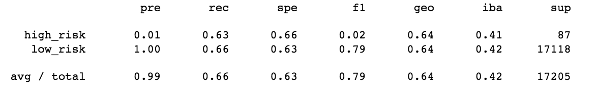

###Cluster Centroids Undersampling
- Balanced Accuracy Score: 0.5292150629907619
- Confusion Matrix:
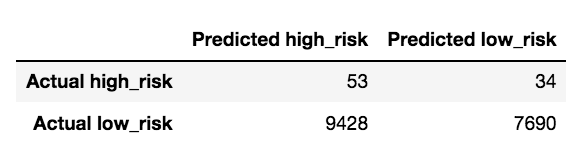
- Imbalanced Classification Report
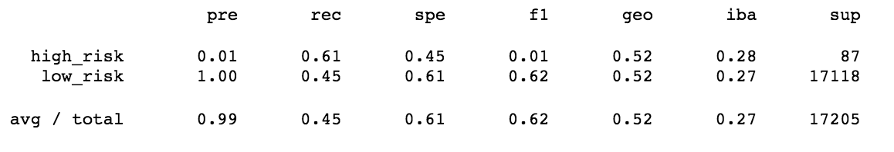

###Combination Sampling SMOTEENN
- Balanced Accuracy Score: 0.6376117496807152
- Confusion Matrix:
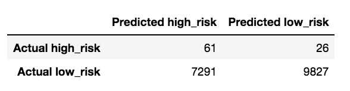
- Imbalanced Classification Report
SMOTEENN

###Balanced Random Forest Classifier
- Balanced Accuracy Score: 0.7877672625306695
- Confusion Matrix:
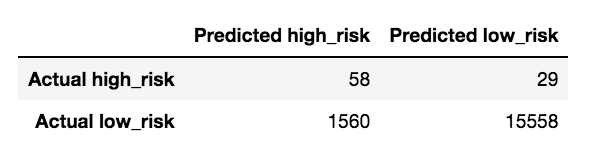
- Imbalanced Classification Report
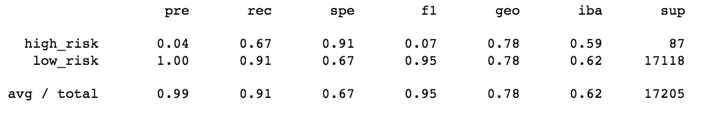SMOTEENN

###Easy Ensemble AdaBoost Classifier
- Balanced Accuracy Score: 0.9316600714093861
- Confusion Matrix:
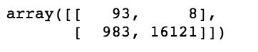
- Imbalanced Classification Report
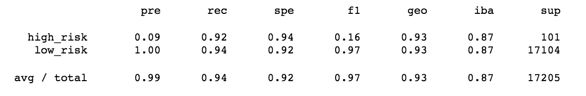SMOTEENN

## Summary
