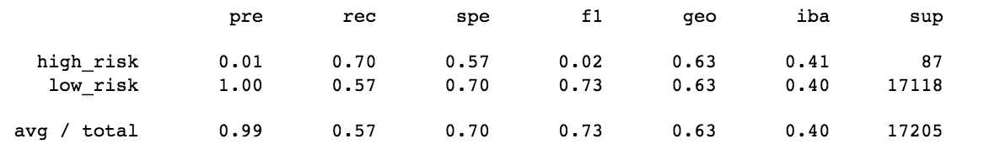

# Credit_Risk_Analysis

## Project Overview
The purpose of this analysis is to use Resampling Models, a SMOTEEN Algorithm and Ensemble Classifiers to predict credit risk for loans.

## Resources
- Data Source: cLoanStats_2019Q1.csv
- Software: Pyton 3.7, scikit-learn 1.0.1, scipy 1.7.1, numpy 1.20.3

## Results
### Naive Random Oversampling
- Balanced Accuracy Score: 0.6497536370265621
- Confusion Matrix:

- Imbalanced Classification Report

### SMOTE Oversampling
- Balanced Accuracy Score: 0.6443721269403855
- Confusion Matrix:

- Imbalanced Classification Report

### Cluster Centroids Undersampling
- Balanced Accuracy Score: 0.5292150629907619
- Confusion Matrix:

- Imbalanced Classification Report

### Combination Sampling SMOTEENN
- Balanced Accuracy Score: 0.6376117496807152
- Confusion Matrix:

- Imbalanced Classification Report

### Balanced Random Forest Classifier
- Balanced Accuracy Score: 0.7877672625306695
- Confusion Matrix:

- Imbalanced Classification Report

### Easy Ensemble AdaBoost Classifier
- Balanced Accuracy Score: 0.9316600714093861
- Confusion Matrix:

- Imbalanced Classification Report

## Summary
All of the models have very low precision in predicting high risk. The best model is the Easy Ensemble AdaBoost Classifier because it has the highest precision, highest balanced accuracy score and consequently has the highest f1 score. However, the precision of the model is still less than 10% and I woud not recommend that the bank use this model to evaluate whether a customer is low or high risk.